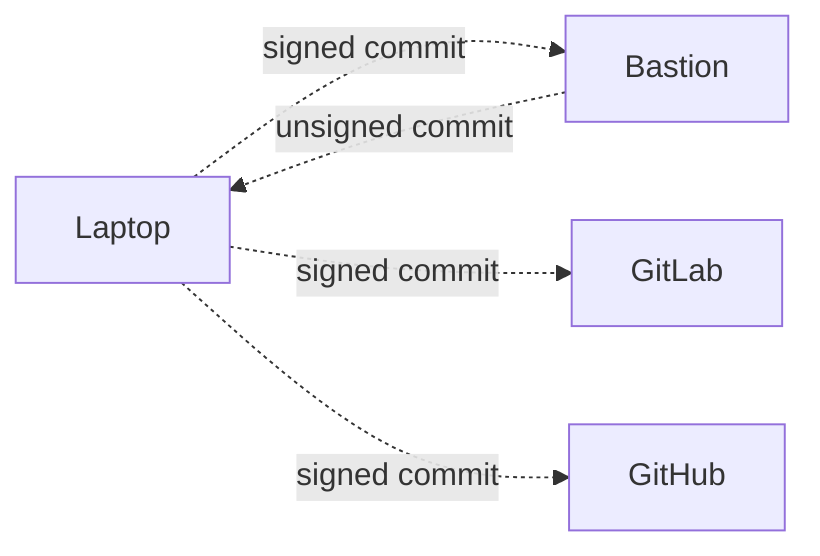

# Git Synchronize v2

_Remote git repository synchronization._

Git SYN is a command line extension for synchronizing git remote repositories.

## Overview



## Dependencies

- [mise](https://mise.jdx.dev) — manages Go toolchain and tasks

## Compiling

```sh
mise run build
```

## Installation

```sh
go install
```

## Usage

```sh
git syn -h
Usage: git-syn [option] ... [command] ...

Remote git repository synchronization.

  -h, --help       display this help and exit
  -v, --version    output version information and exit
  --verbose        enable verbose output
  --debug          enable debug output (implies verbose)
  config           manage git-syn configuration
  daemon           run synchronization on a schedule
  install          install extension to repository
  pre-push         push to all remotes in .gitremotes
  remote           manage tracked remotes
  uninstall        remove extension from repository

Git SYN online help: <https://gitlab.com/git-syn/git-syn>
Full documentation <https://git-syn.gitlab.io/git-syn>
or available locally via: man git-syn
```

### Daemon Mode

To run git-syn as a background process (daemon) with a 5-minute sync interval:

```sh
git syn daemon --interval 5m
```

The interval can also be configured in `~/.config/git-syn/config.yaml`.

## Testing

To run the unit tests:

```sh
go test ./...
```

Or using `mise`:

```sh
mise run test
```

To run all checks (formatting, linting, and tests):

```sh
mise run check
```

## Tasks

| Task | Description |
|------|-------------|
| `mise run build` | Build git-syn |
| `mise run test` | Run all Go tests |
| `mise run check` | Format, lint, and test |
| `mise run fmt` | Format Go source files |
| `mise run lint` | Run go vet |
| `mise run tidy` | Tidy go.mod and go.sum |
| `mise run clean` | Remove build artifacts |
| `mise run man` | Generate man page from markdown |

## License

SPDX-License-Identifier: [GPL-2.0-or-later](COPYING)

## See Also

- [Git Large File Storage (LFS)](https://git-lfs.github.com)

- [GitLab Repository Mirroring](https://docs.gitlab.com/ee/user/project/repository/repository_mirroring.html)

- [git-sync](https://github.com/kubernetes/git-sync)
