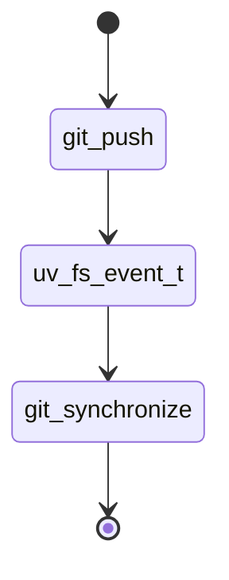

# git-synd

**This is new in v2.**

The daemon monitors `/srv/git` or wherever the mirror has been setup on disk for any file changes with [libuv](https://libuv.org).
From the local repository, if a push is issued to the local remote, then the daemon will see the changes written to the file system
and trigger a synchronization job.

Example directory structure:

```sh
.
├── git-syn-v2.git
└── git-syn.git

2 directories, 0 files
```



The sync job will attempt to push all branches to all remotes listed in the config.

Credential handling is out of scope. See the [git credential helper](https://git-scm.com/docs/git-credential) for more information.

**Do not commit credentials to any git repository. If this is really required, see [sops](https://github.com/mozilla/sops) instead.

